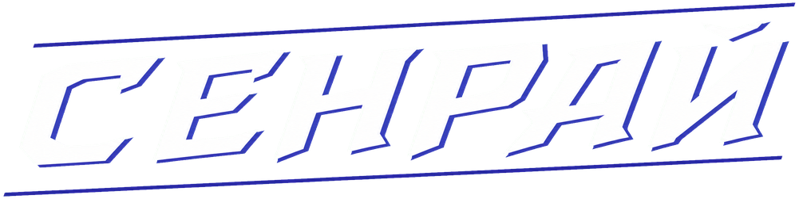

<!--
SPDX-FileCopyrightText: 2017 PJB3005 <pieterjan.briers@gmail.com>
SPDX-FileCopyrightText: 2018 Pieter-Jan Briers <pieterjan.briers@gmail.com>
SPDX-FileCopyrightText: 2019 Ivan <silvertorch5@gmail.com>
SPDX-FileCopyrightText: 2019 Silver <silvertorch5@gmail.com>
SPDX-FileCopyrightText: 2020 Injazz <43905364+Injazz@users.noreply.github.com>
SPDX-FileCopyrightText: 2020 RedlineTriad <39059512+RedlineTriad@users.noreply.github.com>
SPDX-FileCopyrightText: 2020 Víctor Aguilera Puerto <zddm@outlook.es>
SPDX-FileCopyrightText: 2021 Paul Ritter <ritter.paul1@googlemail.com>
SPDX-FileCopyrightText: 2021 Swept <sweptwastaken@protonmail.com>
SPDX-FileCopyrightText: 2021 mirrorcult <lunarautomaton6@gmail.com>
SPDX-FileCopyrightText: 2022 Pieter-Jan Briers <pieterjan.briers+git@gmail.com>
SPDX-FileCopyrightText: 2022 ike709 <ike709@users.noreply.github.com>
SPDX-FileCopyrightText: 2023 iglov <iglov@avalon.land>
SPDX-FileCopyrightText: 2024 Aidenkrz <aiden@djkraz.com>
SPDX-FileCopyrightText: 2024 Kira Bridgeton <161087999+Verbalase@users.noreply.github.com>
SPDX-FileCopyrightText: 2024 Rares Popa <2606875+rarepops@users.noreply.github.com>
SPDX-FileCopyrightText: 2024 router <messagebus@vk.com>
SPDX-FileCopyrightText: 2025 Aiden <28298836+Aidenkrz@users.noreply.github.com>
SPDX-FileCopyrightText: 2025 Piras314 <p1r4s@proton.me>

SPDX-License-Identifier: AGPL-3.0-or-later
-->

 

# Senrai

Senrai — модифицированный форк [Goob Station](https://github.com/Goob-Station/Goob-Station), созданный на базе Space Station 14. Проект содержит собственные механики, игровой контент и серверные интеграции Senrai.

Полный репозиторий проекта не публикуется на GitHub: часть самостоятельно разработанных и отделимых серверных компонентов остаётся закрытой. Это не отменяет условий лицензий унаследованного кода и ассетов.

## Лицензирование

- Код, полученный из Goob Station, Space Station 14 и других проектов, сохраняет исходные лицензии; основная лицензия кодовой базы — `AGPL-3.0-or-later`.
- Оригинальные материалы и код Senrai, исключительные права на которые принадлежат команде Senrai, распространяются по лицензии MIT, если в конкретном файле или метаданных не указано иное.
- Ассеты сохраняют лицензии и авторство, указанные в их метаданных. Среди них могут встречаться `CC-BY-SA`, `CC-BY-NC-SA` и другие лицензии.

Тексты используемых лицензий находятся в каталоге [`LICENSES`](./LICENSES/). Закрытый статус может применяться только к самостоятельным компонентам, на которые не распространяются требования AGPL и иных лицензий исходных проектов.
